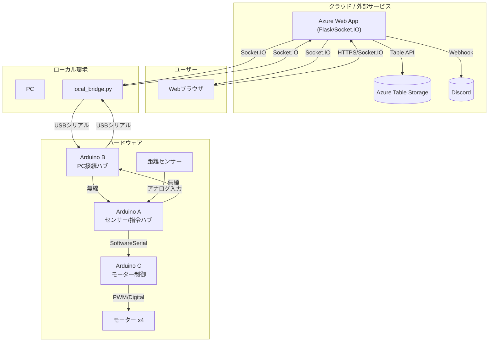

# my-arduino-webapp
Arduino連携 リアルタイム配送・回収システム

1. 概要
本システムは、物理的なポスト（荷物投入ボックス）の状態をリアルタイムで監視し、Webインターフェースを通じて遠隔から操作・確認を行うためのIoTシステムです。距離センサーによる荷物の検知、モーターによる配送・回収動作の実行、およびWeb UIでの状態監視と履歴確認を主な機能とします。

2. システム構成
2.1. 構成図

2.2. 主要コンポーネント

ハードウェア

Arduino A (センサー/指令ハブ): システム全体の頭脳。センサー情報の監視と、他Arduinoへの指令を行う。

Arduino B (PC接続・送受信ハブ): PCとArduinoネットワーク間の通信を中継する。

Arduino C (モーター制御): 指令に基づき、4つのモーターを制御する。

クラウド・サーバー

Azure Web App: Python (Flask)で構築されたバックエンドアプリケーション。

Azure Table Storage: 配達履歴を永続化するためのデータベース。

ソフトウェア

Webアプリケーション (app/): Flask + Socket.IOで構築されたサーバーサイドアプリケーション。

local_bridge.py: ローカルPC上で動作し、Arduino BとAzure Web Appを中継するブリッジプログラム。

Web UI: HTML, Tailwind CSS, JavaScriptで構築されたフロントエンド。

外部サービス

Discord: システムの状態変化をリアルタイムで通知。

3. 機能一覧

荷物配送動作

距離センサーが物体を検知すると、配送動作を開始。

1回目の検知でモーター1, 2を起動し、スロット1へ配送。

2回目の検知でモーター3, 4を起動し、スロット2へ配送。

3回目以降の検知では、ポストが満杯であると判断し、警告を通知。

荷物回収動作

Web UIの「ポストを元に戻す」ボタンから回収動作を開始。

モーターが配送時とは逆の順番（M3→M4→M1→M2）で逆回転し、投入口を初期状態に戻す。

システム内の荷物カウントはリセットされる。

リアルタイム状態監視

Web UI上でシステムの最新状況（「1回目の配達が行われました。」など）をリアルタイムに表示。

配達履歴の管理

配送完了時に、スロット番号と配達日時をAzure Table Storageに記録。

Web UI上で最新の配達履歴を一覧表示。

Discord通知

配達完了、回収完了、満杯警告などの主要イベントをDiscordチャンネルにリアルタイムで通知。

4. 環境設定

本システムの実行には、環境変数の設定が必要です。プロジェクトのルートに .env.example を参考に .env ファイルを作成（ローカルブリッジ実行時）、またはAzureのアプリケーシ
ョン設定に以下の変数を登録してください。

AZURE_STORAGE_CONNECTION_STRING: Azure Storageアカウントへの接続文字列。

WEBHOOK_URL: 通知を送信するDiscordのWebhook URL。

SECRET_KEY: Flaskのセッション暗号化に使用する秘密鍵。

AZURE_TABLE_NAME: 配達履歴を保存するテーブル名（デフォルト: Deliveries）。

AZURE_APP_URL: デプロイされたAzure Web AppのURL。

SERIAL_PORT: Arduino Bが接続されているPCのシリアルポート名。

BAUDRATE: シリアル通信のボーレート（デフォルト: 9600）。

5. 起動コマンド

Azure Web App (スタートアップコマンド)

gunicorn --bind=0.0.0.0:8000 --timeout 600 --worker-class eventlet -w 1 wsgi:app

ローカルブリッジ (PC上で実行)

python local_bridge.py
